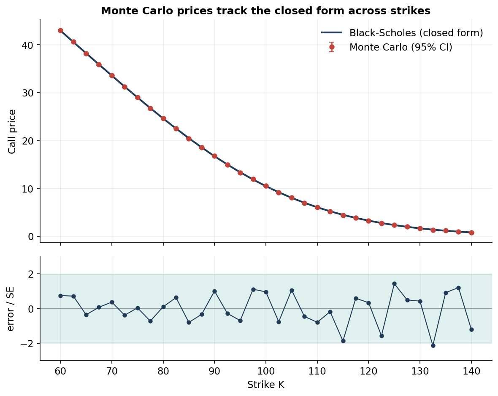
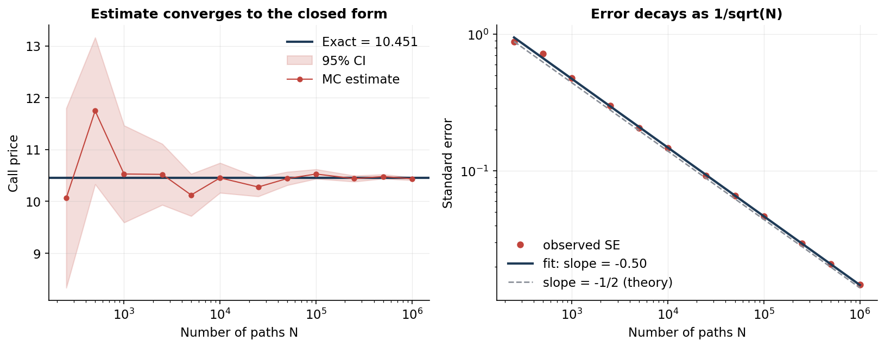
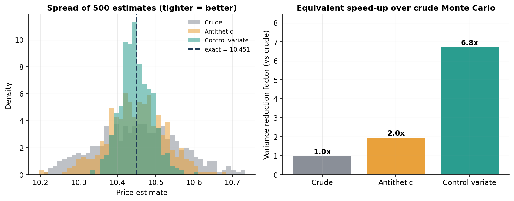
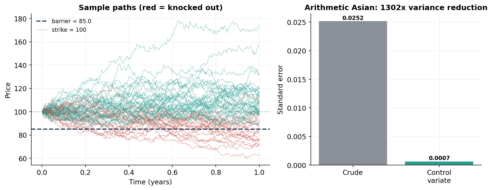

# Monte Carlo Option Pricing Engine

A small, **validated** library for pricing options under the Black–Scholes model
by Monte Carlo simulation — built to demonstrate not just that the numbers come
out right, but that every estimate is checked against known truth, quoted with
an error bar, and made faster with variance-reduction techniques.

The guiding principle is simple: **a Monte Carlo estimate you cannot check and
cannot put an error bar on is a Monte Carlo estimate you cannot trust.** So
every simulated price in this project is validated against a closed form
wherever one exists, and reported with its standard error and a 95% confidence
interval.

---

## What it does

| # | Question | Answer in this repo |
|---|----------|---------------------|
| 1 | Does the simulation agree with the exact price? | **Validation** against the Black–Scholes closed form across strikes, plus Greeks validated by two independent methods |
| 2 | How fast does the error shrink? | **Convergence** study confirming the theoretical `1/√N` rate (fitted slope −0.503 vs −0.500) |
| 3 | Can we get the same accuracy for less compute? | **Variance reduction** via antithetic and control variates, measured over 500 replications (up to **1302×** speed-up) |
| 4 | Can it price options with *no* closed form? | **Path-dependent** arithmetic Asian and barrier options priced by simulation |

Everything below is generated by the scripts in `experiments/` and is fully
reproducible from a fixed seed.

---

## Headline results

### 1. Validation against the closed form

European call prices from crude Monte Carlo lie on top of the analytic
Black–Scholes curve across all strikes. The lower panel shows the error in
units of the Monte Carlo standard error (a z-score): **97% of points fall
within ±1.96**, exactly what an unbiased estimator should produce — the
remaining discrepancy is pure sampling noise, not bias.



Greeks are validated too. Delta and Vega from Monte Carlo (pathwise
differentiation *and* finite differences with common random numbers) match the
closed-form Greeks to within simulation error:

```
Delta  closed form = 0.6368   pathwise = 0.6353 ± 0.0009   finite diff = 0.6363 ± 0.0009
Vega   closed form = 37.524   pathwise = 37.475 ± 0.120
```

### 2. Convergence and the `1/√N` law

The estimate homes in on the exact price as the number of paths grows (left),
and the standard error decays as `1/√N` — on log-log axes the observed errors
lie on a straight line of slope **−0.503**, matching the theoretical −0.5
(right).



### 3. How much does variance reduction help?

Measured honestly, by running each estimator over **500 independent
replications** at a fixed 20,000 paths and comparing the empirical spread of
the estimates. The variance reduction factor (VRF) is the ratio of variances —
a VRF of 10 means you would need 10× as many crude paths to match the accuracy.

| Method | Std of estimate | Bias | Variance reduction |
|--------|-----------------|------|--------------------|
| Crude | 0.1059 | +0.003 | 1.0× |
| Antithetic variates | 0.0753 | −0.002 | **2.0×** |
| Control variate (S_T) | 0.0408 | −0.001 | **6.8×** |



### 4. Options with no closed form

This is where Monte Carlo is indispensable. The **arithmetic-average Asian
call** has no closed-form price, but the **geometric** Asian does — so the
geometric case is used *both* to validate the path simulator and as a control
variate for the arithmetic case (the Kemna–Vorst technique). Because the two
averages are ~0.9999 correlated, the control variate is extraordinary:

```
Geometric Asian   closed form = 5.5655   MC = 5.5758 ± 0.0244   ✓ agree within CI
Arithmetic Asian  crude MC  = 5.7632 ± 0.0252
                  control   = 5.7824 ± 0.0007   ->  1302× variance reduction
Down-and-out call = 10.0503 ± 0.0467  (vs 10.4506 vanilla; knock-out risk makes it cheaper)
```

The left panel shows simulated paths, with those that breach the barrier (and
are therefore knocked out) drawn in red:



---

## The model

Under the risk-neutral measure the underlying follows geometric Brownian
motion,

$$dS_t = r\,S_t\,dt + \sigma\,S_t\,dW_t,$$

so the terminal price is log-normal,

$$S_T = S_0 \exp\!\big[(r - \tfrac12\sigma^2)T + \sigma\sqrt{T}\,Z\big], \quad Z\sim\mathcal N(0,1).$$

An option price is the discounted expected payoff under this measure,
`price = e^{-rT} · E[payoff]`, which Monte Carlo estimates by averaging the
payoff over many simulated draws. European payoffs need only `S_T` (sampled
exactly, with no discretisation error); path-dependent payoffs need the whole
trajectory, sampled step by step with the exact log-normal transition.

---

## Repository structure

```
monte-carlo-option-pricer/
├── src/
│   ├── black_scholes.py   # closed-form price, Greeks, geometric-Asian benchmark
│   ├── simulation.py      # vectorised GBM: exact terminal + full paths, antithetic
│   ├── payoffs.py         # European, Asian (arith/geo), barrier payoffs
│   ├── pricer.py          # MC engine: MCResult (price+SE+CI), control variates
│   └── greeks.py          # pathwise and finite-difference-with-CRN Greeks
├── experiments/
│   ├── config.py             # shared market case, seed, plot style
│   ├── run_validation.py     # experiment 1
│   ├── run_convergence.py    # experiment 2
│   ├── run_variance_reduction.py  # experiment 3
│   └── run_path_dependent.py # experiment 4
├── tests/
│   └── test_pricer.py     # closed-form checks + put-call parity
├── figures/               # generated plots
└── results/               # generated numeric tables
```

The design separates **simulation**, **payoffs**, and **pricing** so the same
paths can be re-priced under any payoff, and new products drop into `payoffs.py`
without touching the engine.

---

## Getting started

```bash
git clone https://github.com/<your-username>/monte-carlo-option-pricer.git
cd monte-carlo-option-pricer
pip install -r requirements.txt

# reproduce every figure and table (run from the repo root)
python experiments/run_validation.py
python experiments/run_convergence.py
python experiments/run_variance_reduction.py
python experiments/run_path_dependent.py

# run the tests
pytest -q
```

Minimal usage:

```python
import numpy as np
from src import black_scholes as bs
from src import pricer

S0, K, T, r, sigma = 100, 100, 1.0, 0.05, 0.20
rng = np.random.default_rng(0)

print(bs.bs_price(S0, K, T, r, sigma, "call"))                    # 10.4506 (exact)
print(pricer.price_european_control(S0, K, T, r, sigma, 100_000, rng))
# European MC (control variate) price = 10.4498  SE = 0.0178  95% CI = [10.4149, 10.4847]
```

---

## Testing

`pytest` pins the library to results that must hold exactly or within
confidence intervals:

- put–call parity for the closed forms (a model-free identity),
- crude MC brackets the Black–Scholes price within its 95% CI,
- the control variate has a strictly smaller standard error than crude MC,
- the geometric-Asian MC matches its closed form within CI,
- a knock-out barrier call is worth strictly less than the vanilla call.

---

## Possible extensions

- Quasi–Monte Carlo (Sobol sequences) for better-than-`1/√N` convergence
- Stochastic-volatility (Heston) dynamics
- American options via Longstaff–Schwartz least-squares Monte Carlo
- Multi-asset baskets with a correlated driving Brownian motion

---

## References

- Glasserman, *Monte Carlo Methods in Financial Engineering* (2003) — the
  standard reference for the variance-reduction techniques used here.
- Kemna & Vorst (1990), "A pricing method for options based on average asset
  values" — the geometric-Asian control variate.
- Black & Scholes (1973); Merton (1973).
